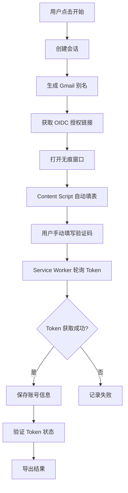

<div align="center">

# 🚀 AWS Auto Registration - Chrome Extension

### ⚡ 一键自动化注册 AWS Builder ID 的浏览器扩展

[](https://chrome.google.com)
[](https://developer.chrome.com/docs/extensions/mv3/intro/)
[](https://www.javascript.com/)
[](LICENSE)

[功能特性](#-功能特性) • [安装指南](#-安装指南) • [使用说明](#-使用说明) • [技术架构](#-技术架构) • [常见问题](#-常见问题)

</div>

---

> ⚠️ **重要提示**：目前插件的**并发多窗口功能不稳定**，建议将并发窗口数设置为 **1**。
>
> 🎉 **新功能**：现已支持**临时邮箱服务**和 **CAPTCHA 自动解决**，实现完全自动化注册！

---

## ✨ 功能特性

### 🎯 核心功能

- **🤖 完全自动化** - 支持临时邮箱 + CAPTCHA 自动解决，无需人工干预
- **🔄 批量注册** - 支持自定义注册数量（1-100），一键批量创建账号
- **📧 双邮箱模式** - Gmail 别名（手动验证码）或临时邮箱（自动验证码）
- **🕵️ 无痕模式** - 自动创建无痕窗口，隔离会话，防止数据污染
- **🔐 Token 管理** - 自动获取并保存 OIDC Access Token 和 Refresh Token
- **🔓 CAPTCHA 解决** - 支持 YesCaptcha、2Captcha、CapSolver、本地 Solver

### 🛡️ 高级功能

- **✅ Token 验证** - 批量验证 Token 状态，识别封禁、过期、无效账号
- **🎨 状态可视化** - 实时显示注册进度、会话状态、Token 状态
- **📊 智能导出** - 支持 JSON/CSV 格式，自动过滤无效 Token
- **💾 历史记录** - 自动保存注册历史，支持查看、复制、导出
- **🚀 Kiro IDE 同步** - 一键同步 Token 至 Kiro IDE，支持 Windows / macOS / Linux

---

## 📧 邮箱服务

### 模式一：Gmail 别名（半自动）

利用 Gmail 的特性，从一个 Gmail 地址生成无限邮箱变体：

| 变体类型 | 示例 | 说明 |
|---------|------|------|
| **+ 号别名** | `user+abc123@gmail.com` | 最可靠，推荐方式 |
| **点号插入** | `u.ser@gmail.com` | Gmail 忽略用户名中的点 |
| **大小写变体** | `UsEr@gmail.com` | Gmail 不区分大小写 |
| **混合变体** | `U.sEr+abc@gmail.com` | 组合以上所有方式 |

> 所有变体都会收到同一个 Gmail 收件箱的邮件，**需要手动填写验证码**

### 模式二：临时邮箱（完全自动）

集成临时邮箱服务，支持自动获取验证码：

- **自动创建邮箱** - 无需预先准备邮箱地址
- **自动获取验证码** - 轮询邮件内容，自动提取验证码
- **完全自动化** - 无需人工干预，实现真正的批量注册

**配置要求**：
- Worker Domain（邮箱服务域名）
- Email Domain（邮箱后缀域名）
- Admin Password（管理员密码）

---

## 🔓 CAPTCHA 自动解决

支持多个 CAPTCHA 服务商，自动解决验证码：

| 服务商 | 类型 | 说明 |
|--------|------|------|
| **YesCaptcha** | 云服务 | 支持 Turnstile、hCaptcha、reCAPTCHA |
| **2Captcha** | 云服务 | 老牌服务商，稳定可靠 |
| **CapSolver** | 云服务 | 高性能 CAPTCHA 解决方案 |
| **本地 Solver** | 本地服务 | 自建 Solver，无需 API Key |

**使用步骤**：
1. 在插件设置中启用 CAPTCHA 自动解决
2. 选择服务商并配置 API Key（本地 Solver 无需）
3. 保存配置后即可自动解决 CAPTCHA

---

## 📦 安装指南

### 方式一：从源码安装（推荐）

1️⃣ **克隆仓库**
```bash
git clone https://github.com/Specia1z/AWS-BuildID-Auto-For-Ext.git
cd AWS-BuildID-Auto-For-Ext
```

2️⃣ **加载扩展**
- 打开 Chrome 浏览器
- 访问 `chrome://extensions/`
- 开启右上角「开发者模式」
- 点击「加载已解压的扩展程序」
- 选择项目根目录

3️⃣ **启用无痕模式**
- 在扩展卡片上，点击「详细信息」
- 找到「在无痕模式下启用」，**必须开启**
- 刷新扩展（点击刷新图标 🔄）

### 方式二：安装打包文件

1. 下载 [Releases](https://github.com/Specia1z/AWS-BuildID-Auto-For-Ext/releases) 中的 `extension.crx` 或 `extension.zip`
2. 解压后按照「方式一」的步骤 2-3 加载

---

## 📖 使用说明

### 快速开始（Gmail 别名模式）

1. **配置 Gmail 地址**：在插件弹窗中输入你的 Gmail 地址并保存
2. **设置参数**：
   - 注册数量：1-100（建议 ≤ 10）
   - 并发窗口：建议设为 **1**（需要手动输入验证码）
3. **点击「开始注册」**
4. **手动填写验证码**：
   - 打开 Gmail 收件箱，找到 AWS 验证码邮件
   - 在注册页面手动输入验证码
5. **等待完成**，查看注册结果

### 快速开始（临时邮箱模式 - 完全自动）

1. **配置临时邮箱服务**：
   - 选择「临时邮箱」模式
   - 填写 Worker Domain、Email Domain、Admin Password
   - 点击「保存配置」
2. **（可选）配置 CAPTCHA 服务**：
   - 启用 CAPTCHA 自动解决
   - 选择服务商并填写 API Key
   - 点击「保存配置」
3. **设置参数**：
   - 注册数量：1-100
   - 并发窗口：临时邮箱模式支持更高并发（1-3）
4. **点击「开始注册」**
5. **完全自动化**，无需人工干预，等待完成即可

### 功能详解

#### 📧 邮箱配置

**Gmail 别名模式**：
```
输入: example@gmail.com
保存后自动生成变体: example+240204abc@gmail.com, e.xample@gmail.com 等
```

**临时邮箱模式**：
```
Worker Domain: mailfly.codeforge.top
Email Domain: example.com
Admin Password: your-admin-password
```

#### 🔓 CAPTCHA 配置

**YesCaptcha / 2Captcha / CapSolver**：
```
服务商: YesCaptcha
API Key: your-api-key-here
```

**本地 Solver**：
```
服务商: 本地 Solver
Solver URL: http://127.0.0.1:5072
```

#### ✅ Token 验证

注册完成后，点击「验证」按钮批量检测所有 Token 状态：

| 状态 | 含义 | 颜色 |
|------|------|------|
| **有效** | Token 正常可用 | 🟢 绿色 |
| **封禁** | 账号被临时封禁 | 🟡 黄色 |
| **过期** | Token 已过期 | 🟠 橙色 |
| **无效** | 账号无效或被删除 | 🔴 红色 |
| **错误** | 网络或服务器错误 | ⚫ 灰色 |
| **未验证** | 尚未验证 | ⚪ 浅灰 |

#### 📊 导出账号

- **JSON 导出**：仅导出有效和未验证的 Token（自动过滤封禁/过期/无效）
- **CSV 导出**：导出完整信息，包含 `token_status` 列

#### 🚀 同步至 Kiro IDE

一键将 Token 同步至 Kiro IDE，**智能检测操作系统**，自动生成对应命令。

**支持的系统：**

| 系统 | 终端 | 配置文件路径 |
|------|------|-------------|
| Windows | PowerShell | `%USERPROFILE%\.aws\sso\cache\` |
| macOS | Terminal | `~/.aws/sso/cache/` |
| Linux | Terminal | `~/.aws/sso/cache/` |

**使用步骤：**

1. 在历史记录中找到成功注册且有 Token 的记录
2. 点击该记录旁边的 **「Kiro」** 按钮
3. 插件会自动检测你的操作系统，生成对应的命令并复制到剪贴板
4. 打开对应的终端（Windows 用 PowerShell，macOS/Linux 用 Terminal）
5. 粘贴并执行命令
6. 重启 Kiro IDE 即可使用同步的账号

---

## 🏗️ 技术架构

### 技术栈

<div align="center">

| 层级 | 技术 | 说明 |
|:----:|:----:|:-----|
| **核心** |  | Chrome Extension API |
| **语言** |  | ES6+ Modules |
| **UI** |   | 原生 HTML/CSS |
| **认证** |  | AWS OIDC Device Flow |

</div>

### 项目结构

```
extension/
├── manifest.json              # 扩展配置（Manifest V3）
├── background/
│   └── service-worker.js     # 后台服务（会话管理、API 调用）
├── content/
│   └── content.js            # 内容脚本（页面自动化）
├── popup/
│   ├── popup.html            # 弹窗界面
│   ├── popup.css             # 弹窗样式
│   └── popup.js              # 弹窗逻辑
├── lib/
│   ├── mail-api.js           # Gmail 无限别名生成器
│   ├── email-service.js      # 临时邮箱服务（自动获取验证码）
│   ├── captcha-service.js    # CAPTCHA 自动解决服务
│   ├── oidc-api.js           # AWS OIDC 认证 API + Token 验证
│   └── utils.js              # 工具函数（密码/姓名生成）
└── icons/
    ├── icon16.png
    ├── icon48.png
    └── icon128.png
```

### 核心流程



---

## ⚠️ 注意事项

- ✅ **必须启用无痕模式权限**，否则无法创建无痕窗口
- ✅ **Gmail 别名模式**：必须配置 Gmail 地址，验证码需手动填写
- ✅ **临时邮箱模式**：必须配置邮箱服务，支持自动获取验证码
- ⚠️ Gmail 别名模式建议并发窗口设为 1，临时邮箱模式支持更高并发
- ⚠️ Token 默认状态为「未验证」，需手动点击「验证」按钮
- ⚠️ CAPTCHA 服务需要 API Key（本地 Solver 除外）
- 📱 仅支持 Chrome 浏览器（基于 Manifest V3）

---

## 🐛 常见问题

<details>
<summary><b>❓ 提示"创建无痕窗口失败"</b></summary>

**原因**：未启用无痕模式权限

**解决方案**：
1. 访问 `chrome://extensions/`
2. 找到本扩展，点击「详细信息」
3. 开启「在无痕模式下启用」
4. 刷新扩展（点击刷新图标 🔄）
</details>

<details>
<summary><b>❓ 提示"未配置 Gmail 地址"或"临时邮箱配置不完整"</b></summary>

**原因**：未在插件中配置邮箱服务

**解决方案**：
1. 点击插件图标打开弹窗
2. 在「邮箱配置」区域选择模式：
   - **Gmail 别名**：输入 Gmail 地址并保存
   - **临时邮箱**：填写 Worker Domain、Email Domain、Admin Password 并保存
3. 确认配置已保存（显示 ✓ 已保存）
</details>

<details>
<summary><b>❓ 临时邮箱模式无法获取验证码</b></summary>

**原因**：邮箱服务配置错误或服务不可用

**解决方案**：
1. 检查 Worker Domain、Email Domain、Admin Password 是否正确
2. 确认邮箱服务正常运行（可以手动访问测试）
3. 查看浏览器控制台（F12）的错误信息
4. 尝试切换回 Gmail 别名模式
</details>

<details>
<summary><b>❓ CAPTCHA 自动解决失败</b></summary>

**原因**：CAPTCHA 服务配置错误或余额不足

**解决方案**：
1. 检查 API Key 是否正确
2. 确认 CAPTCHA 服务账户余额充足
3. 尝试切换其他服务商
4. 如果使用本地 Solver，确认服务正常运行（访问 http://127.0.0.1:5072）
5. 暂时禁用 CAPTCHA 自动解决，手动处理验证码
</details>

<details>
<summary><b>❓ 收不到验证码邮件</b></summary>

**原因**：Gmail 别名可能被识别为垃圾邮件

**解决方案**：
1. 检查 Gmail 的「垃圾邮件」文件夹
2. 检查「所有邮件」确保邮件未被过滤
3. 确认 Gmail 地址输入正确
</details>

<details>
<summary><b>❓ Kiro 同步后 IDE 仍提示未登录</b></summary>

**原因**：配置文件未正确写入或 Kiro 未重启

**解决方案**：
1. 确认在正确的终端中执行命令（Windows 用 PowerShell，macOS/Linux 用 Terminal）
2. 检查 `~/.aws/sso/cache/` 目录是否存在配置文件
3. 完全退出并重启 Kiro IDE
4. 如果仍有问题，尝试删除旧的配置文件后重新同步
</details>

<details>
<summary><b>❓ Windows 执行命令报错</b></summary>

**原因**：可能使用了 CMD 而非 PowerShell

**解决方案**：
1. 确保使用 **PowerShell** 执行命令（不是 CMD）
2. 右键点击开始菜单，选择「Windows PowerShell」或「终端」
3. 粘贴命令并按回车执行
</details>

---

## 📄 License

本项目基于 [MIT License](LICENSE) 开源。

---

<div align="center">

**⭐ 如果这个项目对你有帮助，请给一个 Star！**

Made with ❤️ by [Specia1z](https://github.com/Specia1z)

</div>
